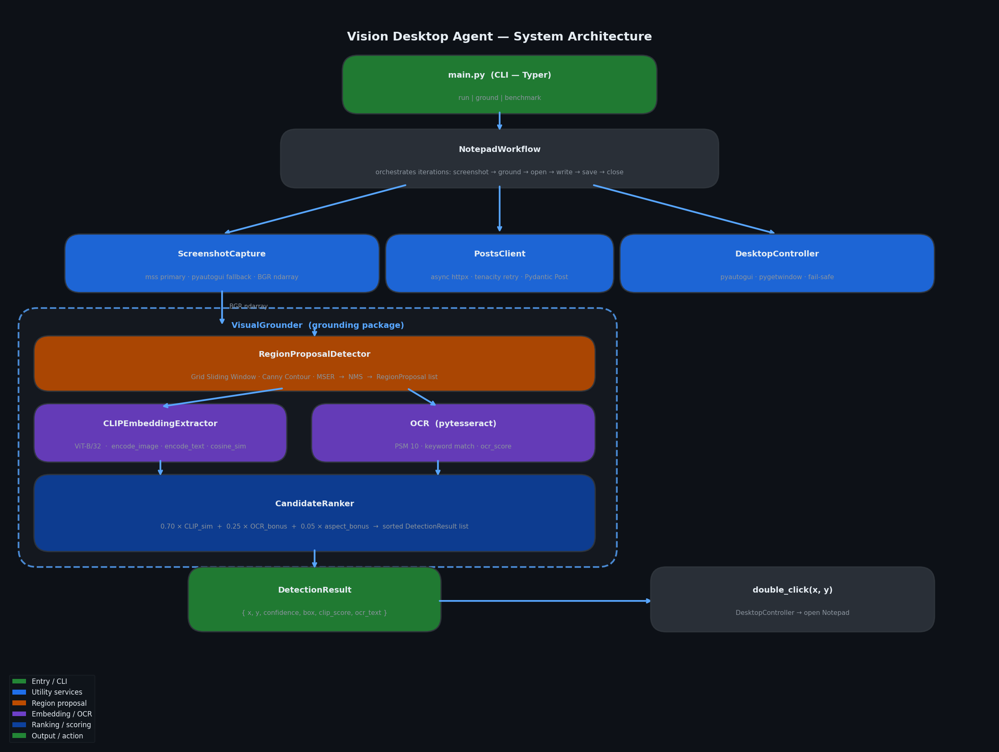
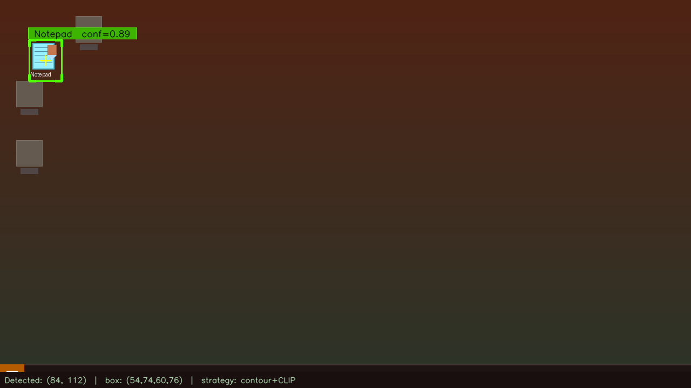
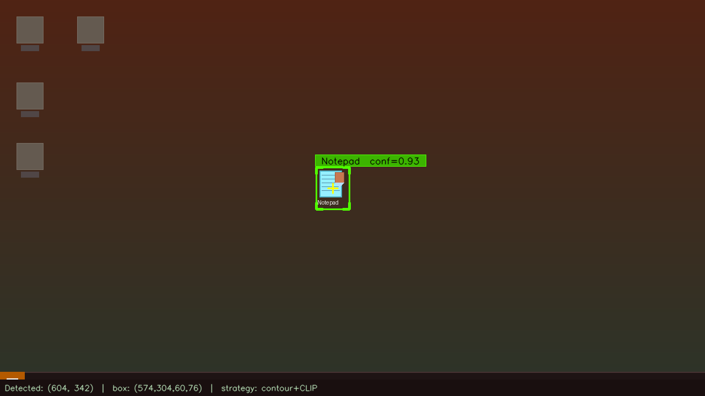
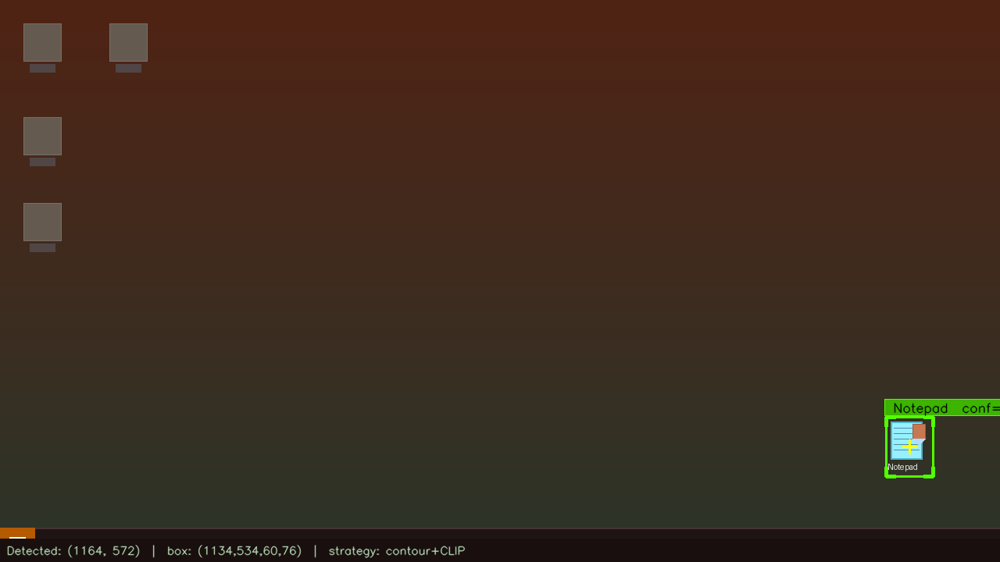

# Vision Desktop Agent

> **Vision-based desktop automation with dynamic icon grounding.**  
> Locates the Notepad icon using CLIP semantic embeddings — no fixed coordinates, no template matching.

---

## Overview

This project implements a production-grade GUI automation agent that:

1. **Dynamically locates** the Notepad desktop icon via a hybrid CLIP + OCR grounding pipeline — regardless of its position, theme, or icon pack
2. **Opens** Notepad by double-clicking the detected icon
3. **Fetches** the first 10 posts from [JSONPlaceholder](https://jsonplaceholder.typicode.com/posts)
4. **Writes** each post as `post_{id}.txt` in a configurable output directory
5. **Repeats** the workflow for a configurable number of iterations

The grounding implementation is inspired by ["GUI Agents with Dynamic Grounding"](https://arxiv.org/abs/2410.04209): icon detection is query-driven and position-agnostic, enabling the same pipeline to find *any* desktop element by natural-language description.

---

## Architecture

```
main.py (CLI)
    └── NotepadWorkflow (orchestrator)
            ├── ScreenshotCapture (mss / pyautogui)
            ├── PostsClient (async httpx + tenacity)
            ├── DesktopController (pyautogui + pygetwindow)
            └── VisualGrounder
                    ├── RegionProposalDetector
                    │       ├── Grid Sliding Window
                    │       ├── Canny Edge / Contour
                    │       └── MSER  →  NMS
                    ├── CLIPEmbeddingExtractor (ViT-B/32)
                    └── CandidateRanker
                            ├── CLIP cosine similarity  (×0.70)
                            ├── OCR keyword bonus       (×0.25)
                            └── Aspect-ratio bonus      (×0.05)
```

See [`docs/design_doc.md`](docs/design_doc.md) for the full design document (problem statement, grounding strategy, tradeoffs, failure cases, scaling discussion).



---

## Screenshots

| Position | Screenshot |
|----------|-----------|
| Top-left |  |
| Centre |  |
| Bottom-right |  |

---

## Repository Structure

```
vision-desktop-agent/
│
├── docs/
│   ├── design_doc.md          # Full design document
│   └── architecture.png       # System architecture diagram
│
├── screenshots/
│   ├── top_left_detected.png
│   ├── center_detected.png
│   └── bottom_right_detected.png
│
├── src/
│   ├── grounding/
│   │   ├── __init__.py        # VisualGrounder façade
│   │   ├── detector.py        # Multi-strategy region proposals + NMS
│   │   ├── embeddings.py      # CLIP image/text embedding extractor
│   │   └── ranking.py         # Semantic candidate ranking
│   │
│   ├── automation/
│   │   ├── desktop_controller.py   # Mouse, keyboard, window management
│   │   └── notepad_workflow.py     # End-to-end Notepad automation
│   │
│   ├── api/
│   │   └── posts_client.py    # Async JSONPlaceholder client
│   │
│   ├── utils/
│   │   ├── screenshot.py      # Fast screen capture + annotation helpers
│   │   └── logger.py          # Loguru structured logging
│   │
│   └── main.py                # CLI entry point (Typer)
│
├── tests/
│   ├── conftest.py
│   ├── test_detector.py       # BoundingBox + RegionProposalDetector
│   ├── test_ranking.py        # CandidateRanker with mock embeddings
│   ├── test_api.py            # PostsClient with mock HTTP transport
│   ├── test_screenshot.py     # ScreenshotCapture annotation helpers
│   └── test_grounder.py       # VisualGrounder integration (mocked CLIP)
│
├── .env.example               # Environment variable reference
├── pyproject.toml             # UV project config + all dependencies
├── .gitignore
└── README.md
```

---

## Installation

### Prerequisites

- Python 3.10+
- [uv](https://docs.astral.sh/uv/) (`pip install uv` or `curl -LsSf https://astral.sh/uv/install.sh | sh`)
- Windows 10/11 (for Notepad automation; grounding module is cross-platform)
- [Tesseract OCR](https://github.com/UB-Mannheim/tesseract/wiki) installed and on PATH (for OCR bonus; optional but improves accuracy)

### Setup

```bash
# 1. Clone the repository
git clone https://github.com/NadaWalid22/vision-desktop-agent.git
cd vision-desktop-agent

# 2. Copy and configure environment variables
cp .env.example .env
# Edit .env to set NOTEPAD_OUTPUT_DIR, CLIP_MODEL, etc.

# 3. Install dependencies (uv creates a virtual env automatically)
uv sync

# 4. Verify installation
uv run python -c "from src.grounding import VisualGrounder; print('OK')"
```

> **Note:** The first run downloads the CLIP ViT-B/32 model (~340 MB). Subsequent runs use the cached version at `~/.cache/`.

---

## Usage

### Run the full workflow

```bash
# 3 iterations, 10 posts each (defaults)
uv run python src/main.py run

# Custom options
uv run python src/main.py run \
    --iterations 5 \
    --posts 10 \
    --output "C:/Users/YourName/Desktop/tjm-project" \
    --confidence 0.25 \
    --retries 3 \
    --log-level DEBUG \
    --log-file logs/agent.log
```

### Grounding debug mode (no automation)

Test the grounding pipeline on a screenshot without running the full workflow:

```bash
# Capture live screenshot and search for Notepad
uv run python src/main.py ground --query "Notepad" --top-k 5

# Use an existing screenshot file and save annotated result
uv run python src/main.py ground \
    --query "Notepad" \
    --screenshot path/to/desktop.png \
    --confidence 0.20 \
    --save annotated_result.png
```

### Benchmark

```bash
uv run python src/main.py benchmark --runs 5
```

### Run tests

```bash
uv run pytest tests/ -v
uv run pytest tests/ -v --cov=src --cov-report=html
```

---

## Configuration

All settings can be overridden via `.env` or environment variables:

| Variable | Default | Description |
|----------|---------|-------------|
| `CLIP_MODEL` | `ViT-B/32` | CLIP model variant |
| `GROUNDING_CONFIDENCE_THRESHOLD` | `0.25` | Minimum detection confidence |
| `GROUNDING_MAX_PROPOSALS` | `200` | Region proposals per screenshot |
| `ACTION_DELAY` | `0.3` | Seconds between UI actions |
| `DETECTION_RETRIES` | `3` | Retry attempts for failed detection |
| `NOTEPAD_OUTPUT_DIR` | `C:/Users/Public/Desktop/tjm-project` | Where to save `.txt` files |
| `JSONPLACEHOLDER_URL` | `https://jsonplaceholder.typicode.com` | API base URL |
| `API_TIMEOUT` | `10` | HTTP timeout in seconds |
| `LOG_LEVEL` | `INFO` | Log verbosity |
| `LOG_FILE` | `logs/agent.log` | Optional log file path |

---

## How the Grounding Works

The grounding pipeline has three stages:

**1. Region Proposals** — Three complementary strategies generate ~200 candidate bounding boxes covering all plausible icon-sized regions (32–160 px):

- **Grid sliding window**: Systematic coverage at 32, 48, 64, 96, 128 px scales
- **Canny edge + contours**: High-contrast icon boundaries
- **MSER**: Stable intensity regions (icon bodies + text labels)

Non-Maximum Suppression (IoU > 0.5) collapses duplicates.

**2. Semantic Scoring** — Each proposal is scored:

```
score = 0.70 × CLIP_cosine_similarity(crop, "Notepad application icon on Windows desktop")
      + 0.25 × OCR_keyword_match(crop, "notepad")
      + 0.05 × aspect_ratio_bonus(crop)
```

CLIP (ViT-B/32) encodes both the image crop and the text query into a shared 512-d embedding space. The cosine similarity between them measures semantic alignment — the model generalises to any Notepad icon variant because it was pre-trained on 400M image-text pairs.

**3. Selection** — The highest-scoring proposal above the confidence threshold is returned as `DetectionResult(x, y, confidence)`.

---

## Key Design Decisions

**Why CLIP over template matching?** Template matching breaks on icon size changes, dark mode, custom icon packs, and unknown icons. CLIP is zero-shot: it works on icons it has never seen before because it reasons about *visual semantics*, not pixel patterns.

**Why a hybrid approach?** CLIP alone can confuse visually similar icons. The OCR bonus provides a high-precision signal when the icon label is visible. The combination reduces false positives significantly at minimal extra cost.

**Why mss over pyautogui.screenshot()?** mss accesses the framebuffer directly and is ~5× faster (~20 ms vs ~100 ms at 1080p), which matters in a tight detection loop.

**Why async httpx?** The workflow could be extended to parallelise multiple post fetches or run in a multi-agent setup where the event loop is shared. Starting with async is a zero-cost investment.

---

## Tradeoffs & Limitations

| Limitation | Impact | Workaround |
|------------|--------|------------|
| CLIP on CPU is ~2.4 s/detection | Workflow is slow | Use GPU; reduce `max_proposals` |
| Notepad is Windows-only | Not portable | Replace workflow; grounding is OS-agnostic |
| Confidence threshold is manual | May need tuning per desktop | `locate_with_retry` decays threshold automatically |
| No UI verification after click | Notepad might not open | Window title polling confirms open state |

---

## Future Improvements

- **GPU acceleration**: CLIP on CUDA/MPS gives 5–10× speedup, bringing total detection to ~0.3 s
- **GroundingDINO integration**: Swap `CLIPEmbeddingExtractor` for GroundingDINO for better bounding-box precision
- **Multi-element grounding**: Extend to locate arbitrary sequences of UI elements (a general GUI agent)
- **Self-calibrating threshold**: Learn per-icon optimal threshold from history
- **Async UI loop**: Run screenshot capture and API fetch concurrently
- **VLM fallback**: Query GPT-4V/Gemini for hard cases where CLIP confidence is low

---

## License

MIT License — see `LICENSE` file.
